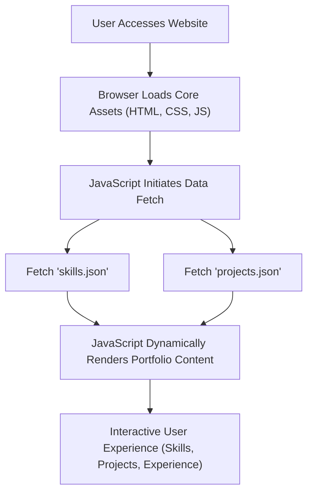

# 🚀 Dynamic Portfolio Website

<p align="center"></p>

## Short Description
Unleash your professional narrative with this elegantly crafted and highly customizable portfolio website template. Engineered for modern developers, designers, and creatives, this project transforms a static résumé into an interactive, engaging online presence. Showcase your skills, projects, and experience with a dynamic, responsive design that captures attention and leaves a lasting impression.

## ✨ Key Features
*   **Stunning Responsive Design:** A meticulously designed user interface ensuring seamless experience across all devices, from desktops to mobile.
*   **Data-Driven Content Management:** Easily update your skills and projects via intuitive JSON files (`skills.json`, `projects.json`), keeping your portfolio fresh without diving into HTML.
*   **Dedicated Sections:** Clearly organized 'Experience' and 'Projects' sections, allowing visitors to quickly navigate and understand your professional journey and accomplishments.
*   **Integrated Resume Download:** Provide instant access to your detailed résumé, streamlining the hiring process.
*   **Robust CI/CD Workflow:** Leverages GitHub Actions for automated testing and deployment, guaranteeing a smooth and reliable update process.
*   **Engaging Interactive Elements:** Dynamic background effects and smooth transitions powered by `particles.min.js` and custom JavaScript for an immersive user experience.
*   **Custom 404 Page:** A beautifully designed custom error page ensures a polished user experience, even when navigating to non-existent links.

## Who is this for?
This project is for any professional – be it a software engineer, web developer, UX/UI designer, or digital artist – who wants a striking, maintainable, and highly effective platform to present their work, skills, and personal brand to potential employers, clients, or collaborators. It's ideal for those seeking to make a powerful online statement without the overhead of complex backend systems.

## Technology Stack & Architecture
This portfolio is built on a robust, lightweight, and modern front-end stack, focusing on speed and maintainability.

*   **Frontend:**
    *   **HTML5:** For semantic structure and content.
    *   **CSS3:** Enhanced with custom styling (`style.css`) for a unique, polished aesthetic, and a dedicated `404.css` for error pages.
    *   **JavaScript (ES6+):** Powers dynamic content loading, interactive elements, and overall user experience (`app.js`, `script.js`, `particles.min.js`).
*   **Data Management:**
    *   **JSON:** Efficiently stores and manages `skills.json` and `projects.json`, enabling quick updates without touching presentation logic.
*   **Workflow & Deployment:**
    *   **GitHub Actions:** Automates the Continuous Integration/Continuous Deployment (CI/CD) pipeline, ensuring code quality and seamless, continuous deployment.

## 📊 Architecture & Database Schema
This project utilizes a client-side architecture where content is dynamically loaded and rendered using local JSON files, eliminating the need for a traditional backend database.



## ⚡ Quick Start Guide
Get your personalized portfolio up and running in no time!

1.  **Clone the Repository:**
    ```bash
    git clone https://github.com/mahammad-shaikh/portfolio_website.git
    cd portfolio_website
    ```
2.  **Open in Browser:**
    Simply open the `index.html` file in your preferred web browser:
    ```bash
    open index.html # For macOS
    start index.html # For Windows
    xdg-open index.html # For Linux
    ```
3.  **Customize Your Content:**
    *   Update your personal information, skills, and projects by editing `skills.json` and `projects.json`.
    *   Replace `assests/images/profile.jpg` with your own professional photo.
    *   Update `assests/resume.pdf` with your current résumé.
    *   Tailor the `index.html` and CSS files (`assests/css/style.css`) to match your personal brand.

## 📜 License
This project is licensed under the MIT License. See the [LICENSE](LICENSE) file for details.