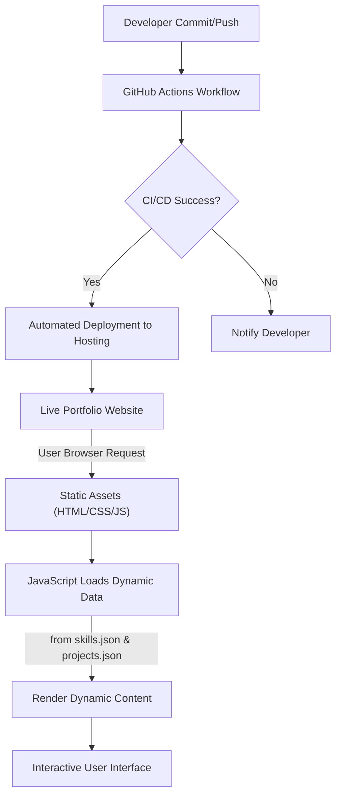

# 🚀 DynamicDev Portfolio Hub

<p align="center"></p>

## Short Description
The **DynamicDev Portfolio Hub** is a sleek, modern, and highly responsive personal portfolio website designed to make a powerful first impression. It elegantly showcases your professional journey, technical prowess, and innovative projects, all driven by dynamic data for effortless updates. Built with a focus on engaging user experience and seamless deployment, this template empowers developers to present their brand with impact.

## ✨ Key Features
*   **Dynamic Content Management:** Skills and projects are loaded from intuitive JSON files (`skills.json`, `projects.json`), allowing for quick and easy content updates without touching the core HTML.
*   **Dedicated Sections:** Comprehensive pages for showcasing your professional `Experience`, detailing impressive `Projects`, and highlighting your `Skills`.
*   **Professional Resume Integration:** A prominent and easily accessible section for downloading your latest resume (`assests/resume.pdf`).
*   **Engaging UI/UX:** Features interactive particle effects (`particles.js`) and smooth animations for a captivating user experience.
*   **Fully Responsive Design:** Optimized for a flawless viewing experience across all devices, from desktops to mobile phones.
*   **Robust CI/CD Pipeline:** Integrated with GitHub Actions (`.github/workflows/ci-cd.yml`) for automated testing and deployment, ensuring continuous delivery and reliability.
*   **Custom Error Page:** A friendly and branded `404.html` to guide users back on track.

## Who is this for?
This project is ideal for **software developers, freelancers, and tech professionals** seeking a polished, easy-to-manage platform to:
*   Impress recruiters and hiring managers.
*   Showcase their project portfolio to potential clients.
*   Establish a strong online personal brand.
*   Collaborate on a well-structured, modern web project.

## Technology Stack & Architecture
The DynamicDev Portfolio Hub leverages a cutting-edge, yet lightweight, frontend stack ensuring performance and maintainability:
*   **Frontend:** HTML5, CSS3, JavaScript (Vanilla JS)
*   **Interactivity:** `particles.js` for captivating background effects.
*   **Deployment & Automation:** GitHub Actions for Continuous Integration and Continuous Deployment (CI/CD).

## 📊 Architecture & Database Schema
This project is a static site, focused on delivering content rapidly. Data for skills and projects is managed via local JSON files, processed by JavaScript on the client-side. The architecture emphasizes modern CI/CD practices.



## ⚡ Quick Start Guide
Getting your own version of the DynamicDev Portfolio Hub up and running is straightforward:

1.  **Clone the Repository:**
    ```bash
    git clone https://github.com/mahammad-shaikh/portfolio_website.git
    cd portfolio_website
    ```
2.  **Open in Browser:**
    Simply open the `index.html` file in your preferred web browser to view the portfolio locally.
    ```bash
    # For macOS/Linux (might vary)
    open index.html
    # For Windows
    start index.html
    ```
3.  **Customize Content:**
    Edit `skills.json` and `projects/projects.json` to personalize your skills and projects. Update `assests/resume.pdf` with your own resume.

## 📜 License
This project is licensed under the MIT License. See the `LICENSE` file for details.